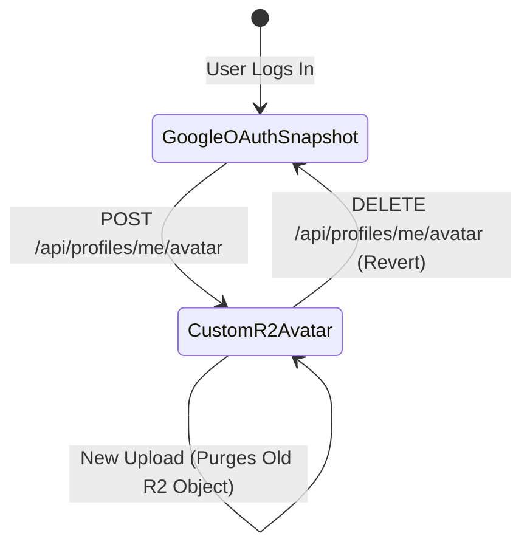

# Cloudflare R2 Avatar Upload & Media Architecture

**Date**: 2026-08-16  
**Status**: Approved & Documented  
**Scope**: `jakarta-backend` & `jakarta-website`  

---

## 1. Overview & Objectives

The community profile system allows community members (speakers, organizers, volunteers, attendees) to upload custom avatar profile pictures. This decouples user profiles from their default Google OAuth profile photo while maintaining a seamless fallback and revert experience.

Object storage and public image delivery are powered by **Cloudflare R2** and Cloudflare's Edge CDN.

---

## 2. Cloudflare R2 Storage Configuration

### 2.1 Bucket Details & Bindings
- **R2 Bucket Name**: `jakarta-bucket`
- **Worker Environment Binding**: `AVATAR_BUCKET`
- **Wrangler Configuration (`wrangler.toml`)**:
  ```toml
  [[r2_buckets]]
  binding = "AVATAR_BUCKET"
  bucket_name = "jakarta-bucket"
  ```
- **Public Custom Domain / CDN**: `https://avatars.awscommunity.id`
- **Object Key Convention**: `avatars/{identifier}_{timestamp}.{ext}`
  - Example: `avatars/avei_1723789200.webp` or `avatars/u_a1b2c3d4_1723789200.png`
  - Public Accessible URL: `https://avatars.awscommunity.id/avatars/avei_1723789200.webp`

### 2.2 Cache Headers & HTTP Metadata
When saving objects into `AVATAR_BUCKET`, the following HTTP metadata is written:
- `contentType`: `image/jpeg` | `image/png` | `image/webp`
- `cacheControl`: `public, max-age=31536000, immutable`

---

## 3. Upload & File Validation Constraints

Strict validation is enforced on all uploaded avatar payloads before streaming or writing to R2.

### 3.1 File Size Limit
- **Maximum Size**: **2 MB** (`2,097,152` bytes).
- **Enforcement**: Payloads exceeding 2MB are rejected with `413 Payload Too Large` or `400 Bad Request`.

### 3.2 Magic-Byte Format Validation
To avoid MIME-spoofing and arbitrary file execution risks, the server inspects the initial byte signatures:
- **JPEG**: Starts with `FF D8 FF`
- **PNG**: Starts with `89 50 4E 47 0D 0A 1A 0A`
- **WebP**: Starts with `52 49 46 46` (RIFF) followed by length and `57 45 42 50` (WEBP)

Any file failing magic-byte validation (including SVGs with potential script payloads or executable binaries) is rejected with `400 Bad Request`.

---

## 4. Lifecycle & Fallback Behavior



1. **Default State (Google OAuth Snapshot)**:
   - On initial Google OAuth login, `extract_user` extracts `picture` (e.g. `https://lh3.googleusercontent.com/...`).
   - Profile `picture_url` points to Google's CDN.
2. **Custom Upload State (`POST /api/profiles/me/avatar`)**:
   - Caller sends multipart form data or binary image.
   - If an existing custom avatar in `avatars.awscommunity.id` is present, it is deleted from `AVATAR_BUCKET`.
   - The new image is written to `AVATAR_BUCKET`.
   - `picture_url` in D1 `profiles` table is updated to `https://avatars.awscommunity.id/avatars/...`.
3. **Revert State (`DELETE /api/profiles/me/avatar`)**:
   - The user requests to remove custom avatar.
   - The custom object is deleted from `AVATAR_BUCKET`.
   - `picture_url` in D1 is reverted to the snapshot Google OAuth photo URL (or `NULL` if none exists).

---

## 5. API Endpoints

### 5.1 `POST /api/profiles/me/avatar`
- **Authentication**: Required (`Authorization: Bearer <google_id_token>` or `X-Debug-User-Email`).
- **Content-Type**: `multipart/form-data` (field: `file`) or binary image (`image/jpeg`, `image/png`, `image/webp`).
- **Success Response (`200 OK`)**:
  ```json
  {
    "email": "user@example.com",
    "username": "johndoe",
    "displayName": "Johnny D",
    "title": "Cloud Architect",
    "picture": "https://avatars.awscommunity.id/avatars/johndoe_1723789200.webp",
    "links": [],
    "isPublic": true,
    "profileUpdatedAt": "2026-08-16T00:00:00Z"
  }
  ```
- **Error Responses**:
  - `400 Bad Request`: Missing file or invalid magic-byte image format.
  - `413 Payload Too Large`: Uploaded file exceeds 2MB limit.
  - `401 Unauthorized`: Missing or invalid authentication token.

### 5.2 `DELETE /api/profiles/me/avatar`
- **Authentication**: Required (`Authorization: Bearer <google_id_token>` or `X-Debug-User-Email`).
- **Purpose**: Deletes custom avatar from R2 and reverts profile picture to the original Google OAuth photo.
- **Success Response (`200 OK`)**:
  ```json
  {
    "email": "user@example.com",
    "username": "johndoe",
    "displayName": "Johnny D",
    "title": "Cloud Architect",
    "picture": "https://lh3.googleusercontent.com/...",
    "links": [],
    "isPublic": true,
    "profileUpdatedAt": "2026-08-16T00:00:00Z"
  }
  ```
